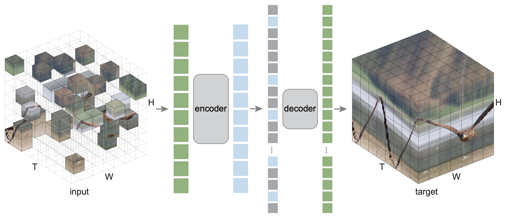

**ALERT**

- Official repos: [facebook/slowfast](https://github.com/facebookresearch/SlowFast/blob/main/projects/mae/README.md) | [facebook/mae-st](https://github.com/facebookresearch/mae_st)

In my test, I've found that their official weights are damaged. The update on this repo might be delayed depending on the progress of this [reported ticket](https://github.com/facebookresearch/SlowFast/issues/668).

---

# Masked Autoencoders As Spatiotemporal Learners
A Keras Implementation. [WIP]

This is a Keras re-implementation of the paper [Masked Autoencoders As Spatiotemporal Learners](https://arxiv.org/abs/2205.09113)

## Catalog

(to-do)

## Visualization demo

(to-do)

## Colab

(to-do)

## Fine-tuning with pre-trained checkpoints

(to-do)

## License

Same as the original license code. This project is under the CC-BY-NC 4.0 license. See [LICENSE](https://github.com/facebookresearch/mae_st/blob/main/LICENSE) for details.
